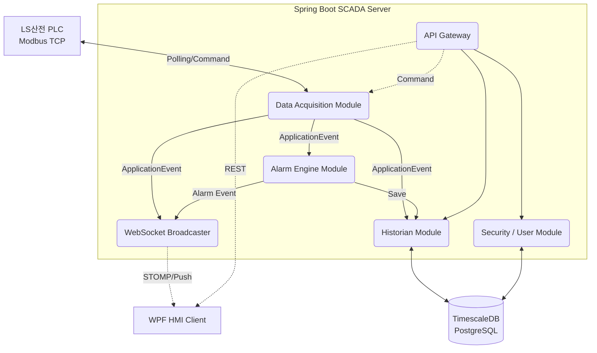

# Smart Climate Control SCADA Server

이 리포지토리는 "스마트 항온항습 자동 제어 시스템"의 중앙 집중형 SCADA 백엔드 서버입니다.
현장 PLC(Modbus TCP)와 직접 통신하여 데이터를 수집하고, 시계열 데이터베이스에 이력을 저장하며,
HMI 클라이언트에 실시간 데이터를 분배하고 알람을 제어하는 역할을 수행합니다.

## 기술 스택 (Tech Stack)

* **Language**: Java 25 (OpenJDK)
* **Framework**: Spring Boot 4.0.6
* **Architecture**: Spring Modulith (도메인 주도 설계 및 멀티 모듈 기반 아키텍처)
* **Database**: TimescaleDB (PostgreSQL 15+ 기반)
* **Security**: Spring Security (권한 기반 접근 제어)
* **Build Tool**: Gradle 9.5.1
* **Communication**:
    * PLC 연동: Modbus TCP (j2mod 또는 modbus4j)
    * 실시간 모니터링 연동: WebSocket STOMP
    * 데이터 조회 및 설정: REST API

---

## 시스템 아키텍처 (System Architecture)

본 시스템은 **Spring Modulith**를 활용하여 도메인별로 명확하게 경계를 나눈 논리적 모듈 구조를 가집니다.
이를 통해 단일 애플리케이션 내에서도 스파게티 코드를 방지하고, 향후 마이크로서비스(MSA) 분리 시 유연성을 극대화합니다.

---

## 멀티 모듈 아키텍처 명세 (Gradle Multi-Module)

루트 프로젝트의 `src` 폴더를 제거하고, 도메인별로 독립된 `build.gradle.kts`를 가지는 물리적 멀티 모듈 구조로 구성합니다.
의존성 버전은 유지보수를 위해 **Gradle Version Catalog (`gradle/libs.versions.toml`)**에서 중앙 집중식으로 관리합니다.

| 논리적 도메인 | Gradle 모듈 (폴더명) | 역할 및 책임 |
|---|---|---|
| **Common/Core** | `core` | 공통 DTO, 예외 처리, 유틸리티 등 모든 모듈에서 공통으로 의존하는 기반 모듈 |
| **Data Acquisition** | `acquisition` | Modbus TCP로 PLC 데이터를 폴링하고 내부 Event(ApplicationEvent)로 발행. 제어 명령 하향 전송. |
| **Historian** | `historian` | 수집된 데이터와 알람 이력을 TimescaleDB에 영속화하고, 연속 집계 등 쿼리 처리. |
| **Alarm Engine** | `alarm` | 센서 데이터를 분석해 임계값 초과 여부를 감지하고, 알람 발생/복구 상태를 관리. |
| **WebSocket** | `websocket` | HMI 클라이언트(WPF)로 실시간 센서값 및 알람 이벤트를 STOMP로 Push. |
| **Security** | `security` | Spring Security 기반 인증/인가 처리 모듈. |
| **API & Boot** | `api` | REST API 엔드포인트 제공. 최종적으로 스프링 부트가 실행되는(`@SpringBootApplication`) 메인 모듈. |

---

## 데이터베이스 설계 (Database Schema)

PostgreSQL의 확장 기능인 TimescaleDB를 활용하여 **관계형 메타데이터와 시계열 데이터를 하나의 데이터베이스 인스턴스에서 통합 관리**합니다.

### 1. 관계형 메타데이터 (PostgreSQL Standard Tables)
* `users`, `roles`, `user_roles`: 시스템 접근 사용자 계정 및 권한 관리 (Spring Security 연동)
* `equipment_meta`: 센서 및 장비 마스터 데이터 (장비 식별자, 데이터 타입, 스케일링 계수, Modbus 통신 주소 등)
* `alarm_rules`: 알람 임계값 설정 정보 (경고/위험 등급, 상/하한값, 지연 시간 설정)

### 2. 시계열 데이터 (TimescaleDB Hypertables)
* `sensor_data` (Hypertable): 초 단위로 발생하는 대량의 센서 데이터 적재. 시간 기반 Chunk 파티셔닝 자동 적용.
* `alarm_history`: 알람 발생 시간, 원인 식별 코드, 확인(Acknowledge) 시간, 복구 시간 이력 기록.

---

## 통신 명세 (Communication Protocol)

### 1. PLC 통신 (Modbus TCP)
* **연결 대상**: LS산전 PLC (IP: `192.168.1.10`, Port: `502`)
* **폴링 주기**: 1,000ms (1초)
* **주요 메모리 맵** (프로젝트 진행 시 상세 맵핑 필요):
    * `MW100`: 현재 온도 (Read - Holding Register)
    * `MW101`: 현재 습도 (Read - Holding Register)
    * `MW110`: 목표 온도 SP (Read/Write)
    * `MW111`: 제어 모드 수동/자동 (Read/Write)

### 2. HMI 클라이언트 통신 (WebSocket STOMP & REST)
* **Topic 구독 (Subscribe - WebSocket)**:
    * `/topic/sensors`: 실시간 온도/습도/장비 상태 데이터 브로드캐스트 (JSON 포맷)
    * `/topic/alarms`: 실시간 알람 발생/복구 알림
* **명령 전송 (Send - REST API / WebSocket)**:
    * `POST /api/v1/control/pump`: 수동 펌프 기동/정지 명령
    * `PUT /api/v1/settings/sp`: 목표 온도/습도 설정값 변경

---

## 개발 환경 구축 방법 (Getting Started)

> [!NOTE]  
> 실제 프로젝트 셋업이 완료되면 환경 변수 및 빌드 명령어를 추가할 예정입니다.

1. Java 25 및 TimescaleDB(로컬 또는 Docker) 설치
2. `application.yml`에 DB 및 Modbus IP 설정
3. `./gradlew bootRun` 명령어로 서버 구동
