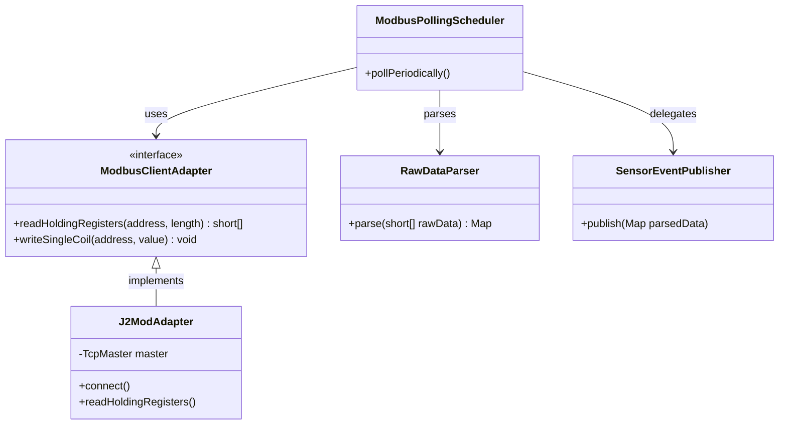
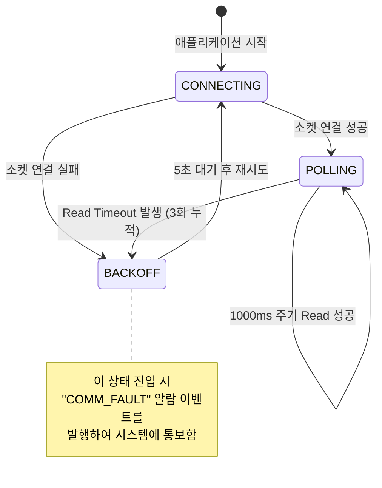

# Detailed Design: Acquisition Module (`acquisition`)

이 문서는 이기종 PLC(현장 제어기기)로부터 데이터를 실시간으로 읽어오고, 제어 명령을 내리는 통신 모듈의 상세 설계를 정의합니다.

## 1. Class Architecture Overview



## 2. Polling Lifecycle & Backoff Strategy

네트워크 불안정으로 인한 폴링 실패 및 자동 재연결(Backoff) 시나리오 설계입니다.



## 3. Data Parsing Algorithm (Scaling)

Modbus 프로토콜은 기본적으로 16비트 정수(`short` 또는 `INT16`)만 전송할 수 있으므로, 소수점을 포함한 아날로그 센서 데이터 처리를 위한 스케일링(Scaling) 알고리즘이 필요합니다.

### 3.1. Read (PLC -> SCADA)
* **PLC 메모리 값**: `255` (온도 25.5℃)
* **파싱 로직 (`RawDataParser`)**: 
  ```java
  float temperature = (float) rawRegisters[0] / 10.0f;
  ```

### 3.2. Write (SCADA -> PLC)
* **HMI 설정 요청값**: `26.5` (목표 온도)
* **변환 로직**: 
  ```java
  short plCTargetValue = (short) (requestedValue * 10.0f);
  // 이후 ModbusClientAdapter.writeSingleRegister() 호출
  ```

## 4. Threading Model
* 기본적으로 Spring `@Scheduled(fixedRate = 1000)`를 이용하여 별도의 스레드 풀(TaskScheduler)에서 동작합니다.
* 장비 대수가 늘어날 경우를 대비하여 폴링 메서드 전체에 타임아웃(Timeout) 방어 코드를 작성하고 비동기(Async) IO 확장을 고려한 인터페이스 구조를 채택했습니다.
