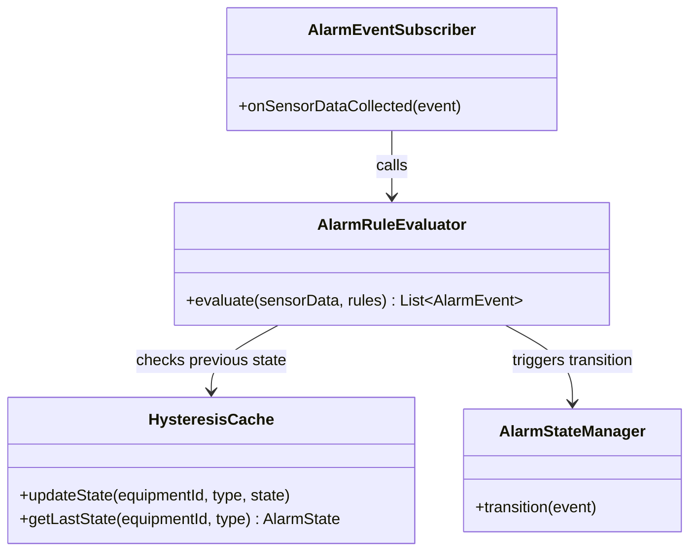
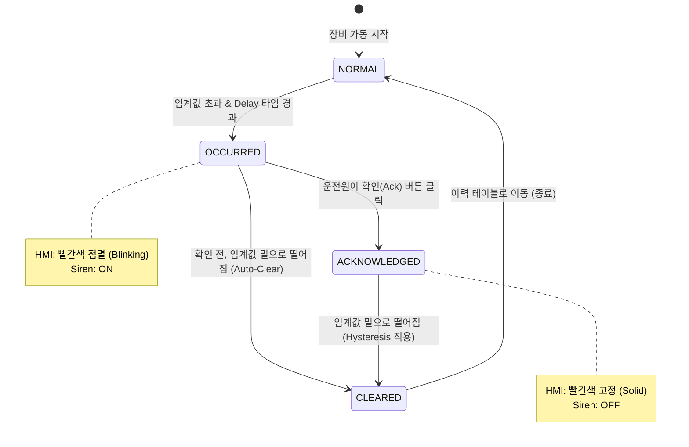

# Detailed Design: Alarm Module (`alarm`)

이 문서는 시스템의 안정성을 책임지는 알람 엔진(Alarm Engine)의 내부 메커니즘을 상세히 기술합니다. 이 모듈의 핵심은 **오탐(False Positive) 방지**와 **명확한 상태 전이(State Machine) 관리**입니다.

## 1. Class Architecture Overview



## 2. Alarm State Machine (상태 전이도)

알람의 생명주기를 완벽하게 추적하기 위한 상태 전이도입니다. HMI 클라이언트에서는 이 상태값을 보고 색상(빨강, 노랑, 깜빡임 등)을 결정합니다.



## 3. Hysteresis (데드밴드) 평가 알고리즘

단순히 "온도가 30도 이상이면 알람"이라고 설정하면, 온도가 29.9와 30.1 사이를 맴돌 때(헌팅 현상) 1초마다 알람이 수백 개 발생할 수 있습니다. 이를 방지하기 위한 로직입니다.

* **발생 조건 (Occurrence)**: 현재값 >= 설정 임계값(Threshold)
* **복구 조건 (Clear)**: 현재값 <= 설정 임계값 - Hysteresis(여유값)

**[알고리즘 의사코드 (Pseudo-Code)]**
```java
// ex) Threshold: 30.0, Hysteresis: 2.0
if (currentState == NORMAL && currentValue >= 30.0) {
    changeState(OCCURRED);
} 
else if (currentState == ACKNOWLEDGED && currentValue <= 28.0) {
    changeState(CLEARED);
}
// 28.0 ~ 30.0 구간에서는 이전 상태(OCCURRED 또는 ACKNOWLEDGED)를 그대로 유지함.
```

## 4. Delay Timer 로직 설계

순간적인 노이즈 튀는 현상(Spike)을 무시하기 위해, 특정 조건이 연속해서 발생해야만 알람으로 인정합니다.

* `Cache<String, Integer>` (장비별 알람 누적 횟수 캐시)를 사용합니다.
* 폴링 주기(1초)마다 조건을 만족하면 캐시 값을 +1 합니다.
* 조건 불만족 시 즉시 캐시 값을 0으로 리셋합니다.
* 캐시 값이 `delaySeconds` (예: 5초 설정 시 5)에 도달하면 `OCCURRED` 이벤트를 발행합니다.
