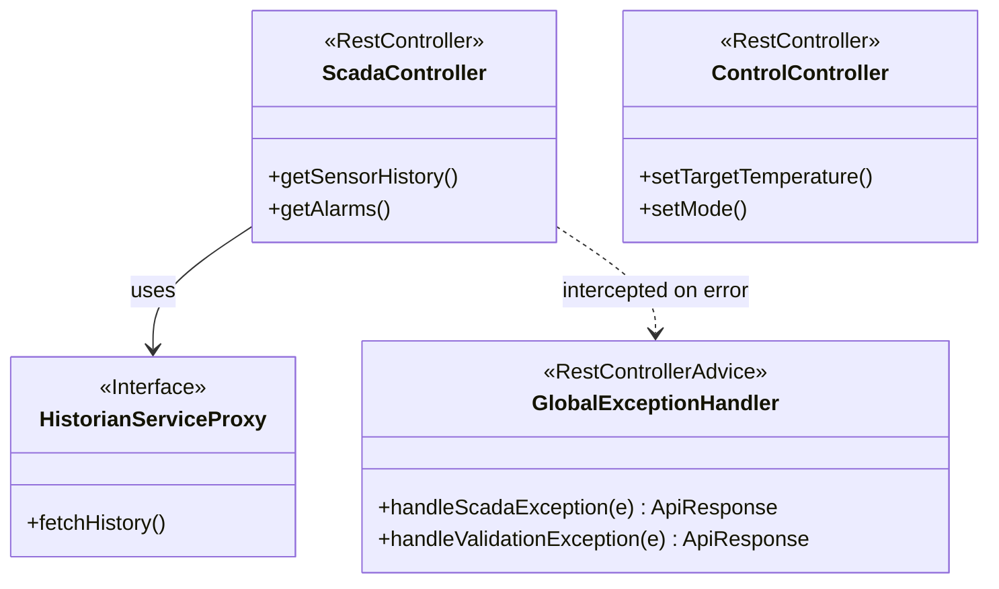

# Detailed Design: API Module (`api`)

이 문서는 외부 클라이언트(HMI, 관리자 웹 등)의 요청을 처리하는 진입점(Entry Point)인 API 레이어의 설계 규격을 정의합니다.

## 1. Class Architecture Overview



## 2. Global Exception Handling (@RestControllerAdvice)

시스템 내부(예: `acquisition`, `core`)에서 발생한 모든 예외는 최종적으로 `api` 모듈의 `GlobalExceptionHandler`에서 낚아채어 클라이언트에게 동일한 JSON 포맷(`ApiResponse`)으로 반환해야 합니다.

**구현 예시 (Pseudo-Code)**:
```java
@RestControllerAdvice
public class GlobalExceptionHandler {

    @ExceptionHandler(ScadaApplicationException.class)
    public ResponseEntity<ApiResponse<?>> handleScadaException(ScadaApplicationException e) {
        ErrorCode errorCode = e.getErrorCode();
        ErrorDetail detail = new ErrorDetail(errorCode.getCode(), errorCode.getMessage());
        return ResponseEntity
                .status(errorCode.getHttpStatus())
                .body(ApiResponse.fail(detail));
    }

    // 예기치 못한 서버 에러 방어
    @ExceptionHandler(Exception.class)
    public ResponseEntity<ApiResponse<?>> handleGeneralException(Exception e) {
        // ... return 500 Internal Server Error Json
    }
}
```

## 3. Module Dependency Rule (모듈 참조 규칙)

* `api` 모듈은 절대로 타 도메인(예: `historian`)의 `Repository` 클래스를 직접 `@Autowired` 해서는 안 됩니다.
* 타 모듈의 데이터를 조회해야 할 경우, 타 모듈이 노출(Export)한 Public Service Interface만을 주입받아 호출해야 합니다. (Spring Modulith의 모듈 캡슐화 원칙).
* 데이터를 조작(Command)하는 행위(예: 수동 펌프 기동)는 직접 호출하지 않고 `core` 모듈의 이벤트를 발행하는 방식을 권장합니다.

## 4. Input Validation
클라이언트로부터 들어오는 모든 제어값(SP 변경 등)은 DTO 내부에 `@Valid` 와 JSR-380 어노테이션(`@Min`, `@Max`, `@NotNull`)을 사용하여 Controller 진입 직전에 유효성을 검사합니다. 통과하지 못한 요청은 비즈니스 로직에 닿기 전에 `400 Bad Request` 처리됩니다.
