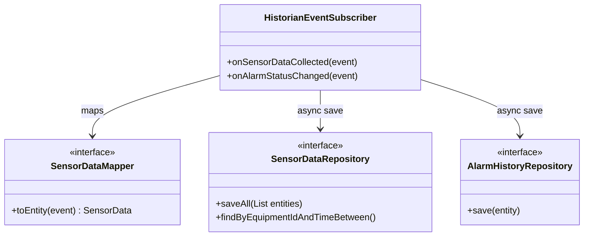

# Detailed Design: Historian Module (`historian`)

이 문서는 실시간으로 쏟아지는 방대한 센서 데이터와 시스템 이벤트를 TimescaleDB에 효율적으로 적재하고 조회하기 위한 데이터 액세스 레이어의 상세 설계입니다.

## 1. Class Architecture Overview



## 2. Asynchronous Event Processing (비동기 처리)

`acquisition` 모듈에서 1초 주기로 발행되는 이벤트를 동기식(Synchronous)으로 DB에 넣으면, DB 지연(Slow Query)이 발생할 경우 PLC 통신 주기(1초)까지 밀리는 대참사가 발생합니다.

* **비동기 큐 (Async Queue)**: Spring의 `@Async`와 `ThreadPoolTaskExecutor`를 사용하여 별도의 스레드 풀에서 DB I/O 작업을 처리합니다.
* **배치 저장 (Batch Insert)**: 초당 1건씩 `INSERT`하는 것은 비효율적이므로, 메모리 버퍼(List)에 데이터를 모아두었다가 5초 주기 또는 100건 도달 시 `saveAll()`로 한 번에 Bulk Insert를 수행하도록 설계합니다.

## 3. TimescaleDB Entity Mapping (JPA)

TimescaleDB의 Hypertable을 활용하기 위한 JPA 엔티티 설계 시 주의사항입니다.

```java
@Entity
@Table(name = "sensor_data")
@IdClass(SensorDataId.class) // 복합키 사용
public class SensorData {

    @Id
    @Column(name = "time", columnDefinition = "TIMESTAMPTZ NOT NULL")
    private Instant time;

    @Id
    @Column(name = "equipment_id", length = 50)
    private String equipmentId;

    @Column(name = "temperature")
    private Double temperature;

    // ... getters and setters
}
```

* **주의**: Hypertable 성능 최적화를 위해 별도의 Surrogate Key(`@GeneratedValue` ID)를 두지 않고, `time`과 `equipment_id`를 묶어 복합키(`@IdClass` 또는 `@EmbeddedId`)로 구성합니다.

## 4. Query Optimization (조회 최적화)

HMI에서 트렌드 차트를 그리기 위해 일주일치 데이터를 요구할 경우, 수백만 건의 JSON이 반환되어 메모리 OOM이 발생할 수 있습니다.
* **Downsampling Query**: JPA 쿼리 메서드 대신, TimescaleDB 고유의 `time_bucket` 함수를 사용하는 Native Query를 작성하여 서버단에서 해상도를 낮춘(예: 1분/1시간 단위 평균값) 데이터만 리턴하도록 설계합니다.
