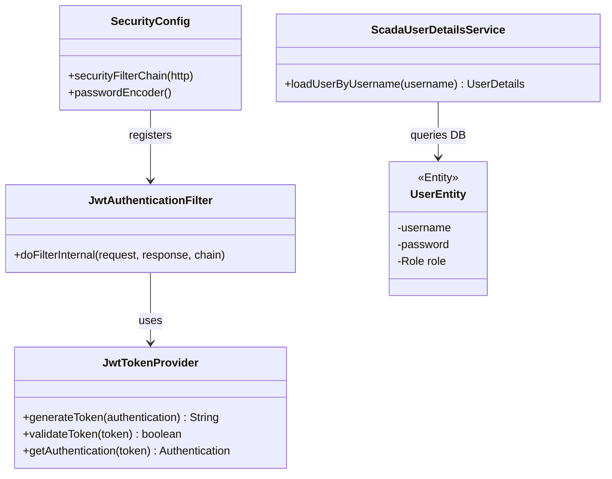

# Detailed Design: Security Module (`security`)

이 문서는 SCADA 시스템의 API 엔드포인트와 WebSocket 연결을 보호하는 Spring Security 필터 및 인증/인가 아키텍처를 정의합니다.

## 1. Class Architecture Overview

## 2. JWT Filter Chain Logic

API 요청 시 HTTP Header (`Authorization: Bearer <token>`)를 검사하는 핵심 필터 흐름입니다.

1. 클라이언트 요청 진입.
2. `JwtAuthenticationFilter`에서 헤더 추출.
3. 헤더가 없거나 유효하지 않은 JWT인 경우, Security Context를 비워둔 채 다음 필터로 넘김 -> 최종적으로 `401 Unauthorized` 예외 발생.
4. 유효한 토큰인 경우:
   - `JwtTokenProvider`가 토큰을 파싱하여 Username과 Role(`ROLE_ADMIN` 등) 추출.
   - Spring Security의 `SecurityContextHolder`에 `Authentication` 객체 강제 주입.
   - 요청된 URL의 권한 요구사항(예: `@PreAuthorize("hasRole('ADMIN')")`)과 비교하여 허용/차단.

## 3. WebSocket (STOMP) Security

REST API뿐만 아니라 WebSocket 연결도 보안 처리가 필요합니다.

* **인증 인터셉터 (ChannelInterceptor)**: 
  * WebSocket 최초 연결(CONNECT 프레임) 시점에 STOMP 헤더(Native Header)에 담긴 JWT 토큰을 검증하는 커스텀 `ChannelInterceptor`를 구현합니다.
  * 토큰이 유효하지 않으면 연결을 즉시 거부(Drop)합니다.
* **이유**: WebSocket은 최초 핸드셰이크만 HTTP로 이루어지고 이후 통신은 TCP 레이어에서 이루어지므로, 일반적인 Spring Security HTTP 필터만으로는 연결 후의 메시지를 차단할 수 없기 때문입니다.

## 4. Password Encryption
* 모든 패스워드는 `BCryptPasswordEncoder`를 사용하여 단방향 해시화 후 DB(`users` 테이블)에 저장됩니다. (평문 저장 절대 금지).
