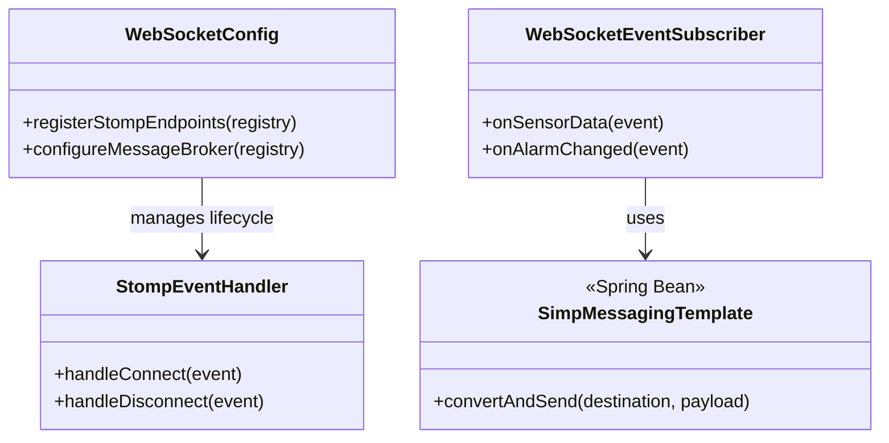

# Detailed Design: WebSocket Module (`websocket`)

이 문서는 서버에서 HMI 클라이언트로 실시간 데이터를 푸시하기 위한 STOMP 브로커 설정 및 메시지 라우팅 내부 구조를 정의합니다.

## 1. Class Architecture Overview



## 2. Topic Broadcasting Logic

`core` 이벤트가 발행되면 `websocket` 모듈은 이를 잡아 즉시 연결된 클라이언트들에게 뿌려줍니다.

### 2.1. Sensor Data Broadcast
```java
@EventListener
public void onSensorDataCollected(SensorDataCollectedEvent event) {
    // 1. 이벤트 객체를 웹소켓 전송용 DTO로 변환
    WsSensorDataDto dto = WsSensorDataDto.from(event);
    
    // 2. "/topic/sensors" 경로를 구독(subscribe) 중인 모든 클라이언트에게 뿌림
    messagingTemplate.convertAndSend("/topic/sensors", dto);
    
    // 옵션: 장비별(equipmentId)로 개별 Topic을 파서 트래픽을 분산할 수도 있음
    // messagingTemplate.convertAndSend("/topic/sensors/" + event.getEquipmentId(), dto);
}
```

## 3. Connection & Session Management

클라이언트의 실시간 접속 상태를 관리해야 합니다. 어떤 운전원이 지금 화면을 보고 있는지 알기 위함입니다.

* Spring의 `SessionConnectEvent`와 `SessionDisconnectEvent`를 리스닝(`@EventListener`)합니다.
* 연결 시 `Principal` (JWT를 통해 식별된 사용자 정보)를 추출하여 접속자 메모리 리스트(또는 Redis)에 등록합니다.
* 특정 클라이언트가 비정상 종료(Ping Timeout)되면 리스트에서 제거하고, 필요한 경우 관리자에게 "클라이언트 연결 끊김" 경고 로그를 남깁니다.

## 4. Message Converter Configuration

수집된 센서 데이터(LocalDateTime 포함)를 JSON으로 직렬화할 때 발생할 수 있는 시간 포맷팅 이슈를 해결합니다.
* Jackson 라이브러리의 `JavaTimeModule`을 등록하고, 날짜/시간 포맷을 `yyyy-MM-dd'T'HH:mm:ss.SSSZ` (ISO-8601 표준)으로 강제하여 C# WPF(Newtonsoft.Json)에서 파싱 오류가 나지 않도록 설정(`WebSocketConfig` 내 `configureMessageConverters` 오버라이딩)합니다.
